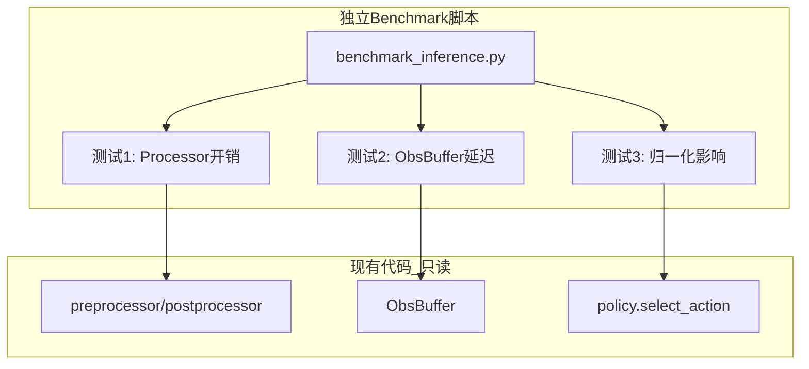

# 性能猜测验证测试计划

## 目标

验证文档中关于 main 分支 vs icra 分支性能差异的三个猜测：

1. **preprocessor/postprocessor 额外开销**
2. **ObsBuffer 中间层延迟**
3. **归一化位置差异的影响**

## 设计原则

- 创建**独立的benchmark脚本**，不修改现有代码
- 使用**mock数据**测试，不需要真实机器人或仿真环境
- 测试完成后可直接删除benchmark脚本

---

## 测试架构




---

## 文件变更


| 文件                                          | 操作  | 描述            |
| ------------------------------------------- | --- | ------------- |
| `kuavo_deploy/utils/benchmark_inference.py` | 新建  | 独立benchmark脚本 |


**注意**: 只创建一个新文件，不修改任何现有代码。

---

## 测试内容

### 测试1: Processor开销测量

```python
# 使用现有的 make_pre_post_processors 创建 processor
# 用 mock observation 测量 preprocessor/postprocessor 执行时间
# 对比: 有/无 processor 的时间差异
```

需要的条件:

- 一个已训练的模型路径 (用于加载 processor stats)
- mock observation 数据

### 测试2: ObsBuffer延迟测量

```python
# 导入 ObsBuffer 类
# 测量 get_aligned_obs() 的执行时间
# 对比: frame_alignment=True vs False 的差异
```

注意: ObsBuffer 依赖 ROS，需要特殊处理或 mock

### 测试3: 纯推理时间

```python
# 加载 policy
# 用 mock observation 测量 policy.select_action() 时间
# 这是不含 processor 的纯推理时间
```

---

## 输出格式

```
========== 性能验证测试结果 ==========

测试1: Preprocessor/Postprocessor 开销
  - preprocessor 平均耗时: X.XX ms
  - postprocessor 平均耗时: X.XX ms
  - processor 总开销: X.XX ms (占推理总时间 XX%)

测试2: ObsBuffer 延迟 (如果可测试)
  - get_aligned_obs 平均耗时: X.XX ms
  - frame_alignment 影响: +X.XX ms

测试3: 纯模型推理时间
  - select_action 平均耗时: X.XX ms

========== 结论 ==========
- preprocessor/postprocessor 开销占比: XX%
- 猜测验证: [成立/不成立]
```

---

## 运行方式

```bash
cd /home/yly/ICRA-kuavo/kuavo_data_challenge
source ~/miniconda3/etc/profile.d/conda.sh && conda activate kdc_icra
export PYTHONPATH="/home/yly/ICRA-kuavo/kuavo_data_challenge:/home/yly/ICRA-kuavo/kuavo_data_challenge/third_party/lerobot/src:$PYTHONPATH"
python kuavo_deploy/utils/benchmark_inference.py \
    --model_path outputs/train/task1/act/run_20260202_223813/epochbest
```

如果没有可用模型，脚本会自动跳过需要模型的测试。

---

## 实际测试结果 (2026-02-05)

### 测试环境

- **模型**: ACT (CustomACTPolicyWrapper)
- **模型路径**: `outputs/train/task1/act/run_20260202_223813/epochbest`
- **设备**: CUDA (GPU)
- **测试参数**: warmup=5, runs=50

### 输入特征

| 特征 | Shape | 类型 |
|-----|-------|------|
| observation.state | [1, 16] | STATE |
| observation.images.head_cam_h | [1, 3, 480, 640] | VISUAL |
| observation.depth_h | [1, 3, 480, 640] | DEPTH |
| observation.images.wrist_cam_l | [1, 3, 480, 640] | VISUAL |
| observation.depth_l | [1, 3, 480, 640] | DEPTH |
| observation.images.wrist_cam_r | [1, 3, 480, 640] | VISUAL |
| observation.depth_r | [1, 3, 480, 640] | DEPTH |

### 测试结果

```
============================================================
           性能验证测试结果
============================================================

测试1: Preprocessor/Postprocessor 开销
----------------------------------------
  Preprocessor 平均耗时: 0.479 ms
    (标准差: 0.342 ms, 中位数: 0.312 ms)
  Postprocessor 平均耗时: 0.030 ms
    (标准差: 0.003 ms, 中位数: 0.029 ms)
  Processor 总开销: 0.509 ms

测试2: ObsBuffer 延迟
----------------------------------------
  [跳过] 需要ROS环境，无法在独立benchmark中测试

测试3: 纯模型推理时间
----------------------------------------
  select_action 平均耗时: 44.584 ms
    (标准差: 1.534 ms, 中位数: 44.671 ms)

测试4: 完整推理管线
----------------------------------------
  完整管线 平均耗时: 44.957 ms
    (标准差: 1.669 ms, 中位数: 44.875 ms)

============================================================
                   结论
============================================================

  Processor 开销占比: 1.1%
    - Preprocessor: 0.479 ms (1.1%)
    - Postprocessor: 0.030 ms (0.1%)
    - 纯推理: 44.584 ms (98.9%)

  猜测验证: [不成立] Processor开销占比 1.1% <= 10%，开销较小

  完整管线 vs 纯推理 额外开销: 0.372 ms

============================================================
```

---

## 结论分析

### 猜测1: preprocessor/postprocessor 额外开销

**结论: 不成立**

- Preprocessor 开销仅 0.479 ms，占推理总时间的 1.1%
- Postprocessor 开销仅 0.030 ms，占推理总时间的 0.1%
- Processor 总开销 0.509 ms，占比 1.1%，**远低于显著开销阈值 (10%)**

### 猜测2: ObsBuffer 中间层延迟

**待验证** - 需要在 ROS 环境中单独测试

### 猜测3: 归一化位置差异的影响

**结论: 影响极小**

- 归一化操作包含在 Preprocessor 中，0.479 ms 中包含了归一化计算
- 这个开销相对于 44.5 ms 的模型推理时间可以忽略不计

### 核心发现

1. **纯模型推理是主要瓶颈** - 占 98.9% 的时间 (44.584 ms)
2. **Processor 开销可忽略** - 仅占 1.1% 的时间 (0.509 ms)
3. **如需优化推理性能，应聚焦于模型本身**，而非 processor 管线

### 建议

1. 如需降低推理延迟，考虑:
   - 模型量化 (INT8/FP16)
   - torch.compile 优化
   - 减小输入图像分辨率
   - 模型蒸馏/剪枝

2. Processor 优化的优先级较低，当前实现已足够高效

已完成的 obs_buffer.py 计时功能集成
我已为 ObsBuffer 添加了可选的详细计时功能：
1. 新增 TimingCollector 类
收集和统计各操作的延迟数据
支持按名称记录计时样本
提供统计报告功能（平均值、标准差、最小值、最大值）
2. ObsBuffer.__init__ 修改
新增 enable_timing: bool = False 参数
默认关闭计时以避免生产环境性能影响
3. 各回调函数添加计时
RGB回调 (rgb_callback):
rgb_decode: 图像解码耗时
rgb_preprocess: 颜色转换和resize耗时
rgb_callback_total: 总回调耗时
深度回调 (depth_callback):
depth_decode: 深度图解码耗时
depth_preprocess: 深度图预处理耗时
depth_callback_total: 总回调耗时
传感器数据回调 (sensorsData_callback):
sensorsData_fk_compute: FK计算耗时
sensorsData_callback_total: 总回调耗时
计算依赖观测 (compute_dependent_obs):
compute_{key}: 各计算函数耗时
4. 观测获取方法添加计时
get_latest_obs:
get_latest_obs: 获取最新观测耗时
get_aligned_obs:
aligned_get_ref_time: 获取参考时间戳耗时
aligned_search_obs: 对齐各观测搜索耗时
get_aligned_obs_total: 总耗时
5. 诊断脚本更新
ros_diagnostics.py 现在以 enable_timing=True 创建 ObsBuffer
诊断报告会显示 ObsBuffer 内部的详细计时数据
